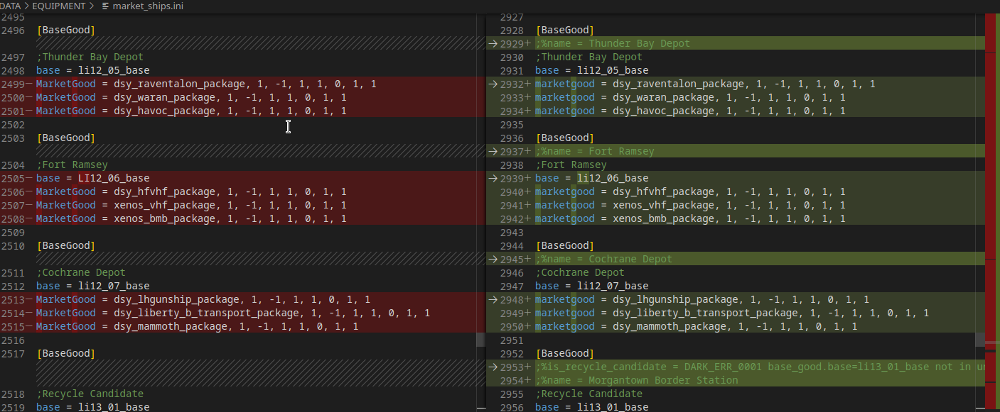

# fl-darklint

Tool for validations, formatting and denormalization with human readable comments

## Features

- Parses all game configs, and runs its sets of validation.
  - By default package of validations to ensure this Freelancer folder game data is compatible with Darkstat
  - list is expandable further. (to create validator folder later)
- Darklint is able to format configs to more uniform way
  - like having all specified parameters bringing to lower case.
  - Or writing all sections [Section] in same way
  - or it can round all floating numbers to exact same format.
  - it uses ORM library fl-configs able to map all data for reading and writing back using Data structs to do that
    so it is functionality easy to expand further. See [formmater](./darklint/formatter/) package for expanding.
- Additionally it is capable to supply human readable comments to config objects for easier life.
  - `denormalizer` module is responsible for this
  - for example all [Base] entities in universe.ini file receive comment what is their infocard name right in a config file

## Denormalization features:

- to `market_*.ini` files it adds to bases human readable name extracted from infocard.txt
- to `market_*.ini` reports if base is recycle_candidate, by checking missmatch in its set system and pressence in files + if system is `fp7` or `ga13`, example:
  - `;%is_recycle_candidate = DARK_ERR_0001 base_good.base=ga06_03_base not in universe.ini->Base.system->System.file->systems\ga13\ga13.ini | universe.ini->Base.system=ga13 in [[ga13 fp7]]`
  - see picture example below

## Future development

Currently the project reached Minimum Viable Product state.
- As of version v1.7.0 succesfully managed to parse all comments in the way that they are written back without impacting development of game configs.
- Example of usage is provided by [Github Workflow for FLSR](https://github.com/darklab8/FLSR/blob/main/.github/workflows/test.yml)
- For applying formatting, u need to use it locally. 

The tool is intended to add additional features in linting configurational files.
It is possible adding any other additional rules for checking foreign key data integrity between objects
Or adding additional commented strings to objects with helpful information

Request new features [here](https://github.com/darklab8/fl-darklint/issues) or there [Darklab Discord server](https://discord.gg/aukHmTK82J)

## Usage with installation
### At linux

- install curl if not installed.(`apt update && apt install -y curl` for debian/ubuntu)
- install darklint with `sudo rm $(which darklint) ; sudo curl -L $(curl -Ls -o /dev/null -w %{url_effective} https://github.com/darklab8/fl-darklint/releases/latest | sudo sed "s/releases\/tag/releases\/download/")/darklint-linux-amd64 -o /usr/local/bin/darklint && sudo chmod 777 /usr/local/bin/darklint`
- check installation with `darklint version` command. Expect to see `OK darklint version: v{version}`

### install specific version

- install with `rm $(which darklint) ; curl -L https://github.com/darklab8/darklint/releases/download/v{VERSION}/darklint-linux-amd64 -o /usr/local/bin/darklint && chmod 777 /usr/local/bin/darklint`

### At Windows

- install [Git Bash](https://git-scm.com/downloads)
- install darklint `mkdir -p ~/bin ; rm $(which darklint) ; curl -L $(curl -Ls -o /dev/null -w %{url_effective} https://github.com/darklab8/fl-darklint/releases/latest | sed "s/releases\/tag/releases\/download/")/darklint-windows-amd64.exe -o ~/bin/darklint.exe && chmod 777 ~/bin/darklint.exe`
- check installation with `darklint version` command. Expect to see `OK darklint version: v{version}`

P.S. `~/bin/darklint.exe` must be any valid bin path (`echo $PATH`, `echo %PATH%` to get the list) accessable by your tool from where u are going to use it.

### Manual installation

Go to [releases](<https://github.com/darklab8/fl-darklint/releases>) and download necessary binary file on your own and put to some bin folder present in your $PATH.

### Manual building

- install `git`
- install go of version [like in workflow](./.github/workflows/build.yml)
- install [Taskfile](<https://taskfile.dev/usage/>)
- run `task build`. The result is in dist folder.
- if smth is incorrect, see github workflow mentioned above for up to date instructions

## after installation

- go to Freelancer folder root and apply with `darklint format`

## Simplified usage:

- just [download here](https://github.com/darklab8/fl-darklint/releases)
- copy executable file to root folder of freelancer
- run `{{executable}} format`
- check help info in `{{executable}} --help`
- check additional flag to command with `{{executable}} format --help`

## Dev Requirements

- cobra generator https://github.com/spf13/cobra-cli/blob/main/README.md
- cobra guide https://github.com/spf13/cobra/blob/main/user_guide.md
- godoc
- add binary discovery for cobra-cli, godoc detection
  - `export PATH="$PATH:/usr/local/go/bin:$HOME/go/bin"`
- Git hooks of conventional commits
  - [docs](https://gist.github.com/qoomon/5dfcdf8eec66a051ecd85625518cfd13)
  - [app](https://www.npmjs.com/package/git-conventional-commits)

## Architecture

```mermaid
flowchart TD
    darktool --> cmd
    cmd[cmd\nUser Commands to CLI interface]
    cmd --> validator[validator\nlints freelancer configs to strict format]
    validator --> flconfigs[flconfigs\nProvides static typed access to parsedFreelancer configs]
    validator --> denormalizer[denormalizer\nDenormalizes parsed data for more\nhuman readable view of freelancer configs]
    denormalizer --> flconfigs
```

## Contributors

- [@dd84ai](https://github.com/dd84ai) // coding
- [@Groshyr](https://github.com/Groshyr) // spark of inspiration for project birth + beta tester + feature requester + domain expert

# License

fl-darklint was originally created by Andrei Novoselov (aka darkwind, aka dd84ai)
The work is released under GPL license, free to modify, copy and etc. as long as you keep code open source and mentioned original author.
See [LICENSE](./LICENSE) file for details.
